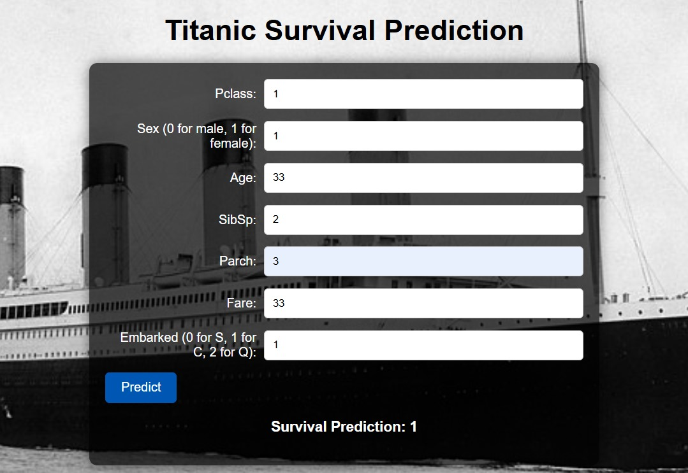
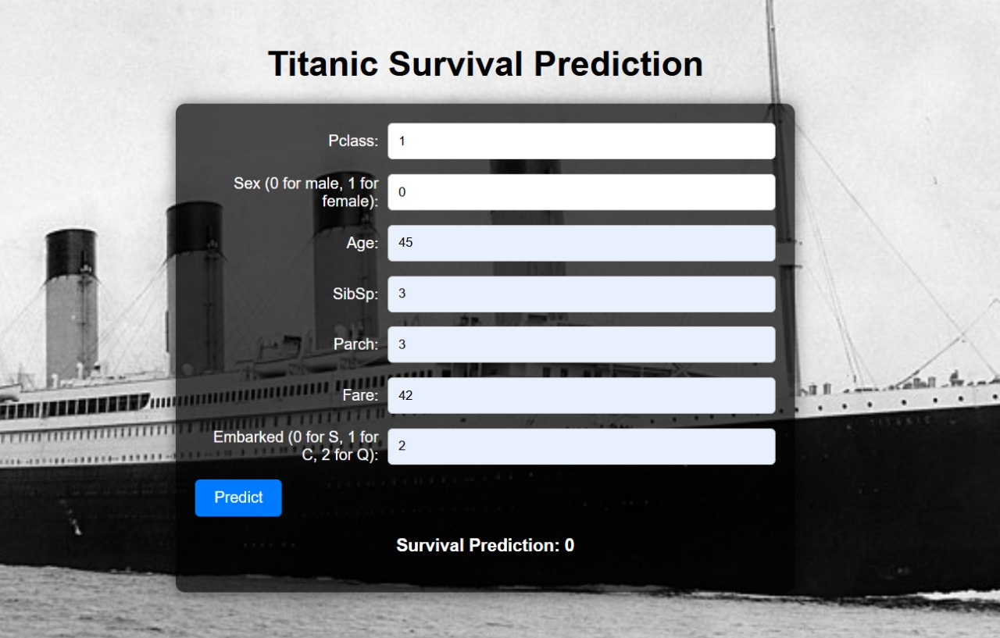

# Titanic Survival Prediction

**Project Overview**: This project provides a web application for predicting Titanic survival chances using a machine learning model. The application is built using Flask, with the entire implementation and model training conducted within a Jupyter Notebook.

## Project Structure

Here is the structure of the project directory:

```
      Titanic_Survival_Prediction/
   ├── Titanic_Survival_Prediction.ipynb
   └── dataset/
   └── train.csv
```
- `Titanic_Survival_Prediction.ipynb`: Jupyter Notebook containing the entire codebase including data preprocessing, model training, Flask app implementation, and ngrok integration.
- `dataset/train.csv`: Dataset used for training the model.

## Setup Instructions

### Prerequisites

- Python 3.x installed
- Required Python packages (listed below)

### Installation

1. **Clone the Repository**
   ```bash
   git clone https://github.com/MOHAN1665/Titanic_Survival_Prediction
   cd Titanic_Survival_Prediction

2. **Install Required Packages**
Ensure you have the following Python packages installed:
   ```bash 
   pip install flask scikit-learn pandas numpy ngrok

4. **Start the Flask Application**
   
- Open Titanic_Survival_Prediction.ipynb in Jupyter Notebook.
- Run the cells to train the model and start the Flask application.
- The notebook integrates ngrok to expose the Flask app with a public URL.

## Running the Application
- Execute the notebook cells to train the model and run the Flask app.
- The notebook will display a public URL from ngrok where you can access the web application.

## Accessing the Application
Open the provided ngrok URL in your web browser to interact with the Titanic survival prediction app.

## Technologies Used
- Jupyter Notebook
- Flask (for web application)
- scikit-learn (for machine learning)
- pandas (for data manipulation)
- ngrok (for exposing the local server)

## Notes
- The Flask application and model training are integrated within the Jupyter Notebook for ease of use.
- Ensure you have a stable internet connection for ngrok to work properly.

## Example Outputs

<p align="center">
  
  
</p>


## Contributors
- [MOHAN1665](https://github.com/MOHAN1665)


This README covers the project structure, setup instructions, and usage details for your Titanic survival prediction app. Adjust any placeholder URLs or information as needed!


